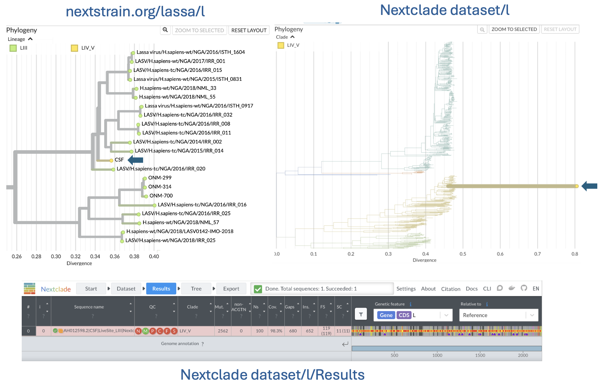

# Debugging L segment assignment

L segment Genbank record [AH012598](https://www.ncbi.nlm.nih.gov/nuccore/AH012598) is currently being assigned to lineage IV_V by the draft Nextclade dataset, even though it [places among lineage III (LIII) on the live tree](https://next.nextstrain.org/lassa/l?c=lineage&f_genbank_accession=AH012598). Checking [the literature](https://pmc.ncbi.nlm.nih.gov/articles/PMC5823357/), AH012598 (strain=CSF) should be a lineage III sample. This is a temporary branch and directory created to facilitate discussion on how to address this and similar situations.

- [Run AH012598 on the L segment Nextclade dataset](https://clades.nextstrain.org/?dataset-url=https://github.com/nextstrain/lassa/tree/main/nextclade_data/l/&input-fasta=https://raw.githubusercontent.com/nextstrain/lassa/refs/heads/do-not-merge-debug-l/debug/AH012598.fasta)
- [Nextclade parameters](https://github.com/nextstrain/lassa/blob/2a533fd68e5f3a5b33592c4550ad1487440096ca/nextclade/defaults/l/pathogen.json#L18-L59)

For more background on the Nextclade dataset:

- [View L Segment scaffold tree](https://next.nextstrain.org/fetch/raw.githubusercontent.com/nextstrain/lassa/main/nextclade_data/l/tree.json)
- [Run L Segment Nextclade](https://clades.nextstrain.org/?dataset-url=https://github.com/nextstrain/lassa/tree/main/nextclade_data/l/)
